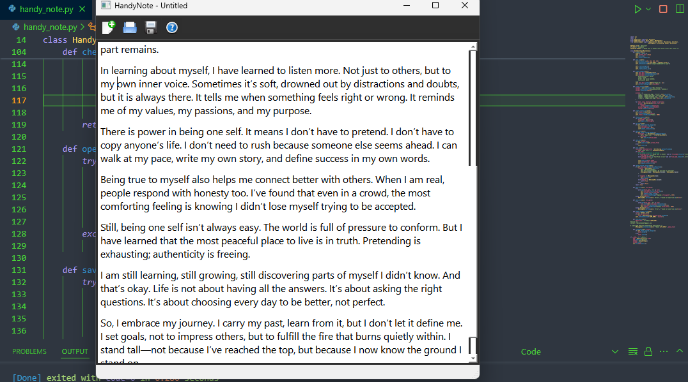

# HandyNote - Lightweight Note-Taking Application

 <!-- Add a screenshot if available -->

A simple and intuitive note-taking application built with PyQt5, featuring quick file operations and a clean interface.

## Features

- Create new notes
- Open existing text files (.txt, .hnote, and all files)
- Save notes with custom formats
- Clean, dark-themed UI
- Keyboard shortcuts (Ctrl+S for save)
- Drag-and-drop file opening
- About information panel
- Responsive text editor with font styling

## Installation

1. Ensure Python 3.x is installed
2. Install required dependencies:
   ```bash
   pip install pyqt5

Clone/download the repository

Run the application:

    ```bash
    python handy_note.py

Usage
New File: Click the New icon or select from menu

Open File: Click the Open icon or use Ctrl+O

Save File: Click the Save icon or use Ctrl+S

About: Click the help icon for version information

File Formats
HandyNote format (.hnote)

Plain text format (.txt)

All file types (*)